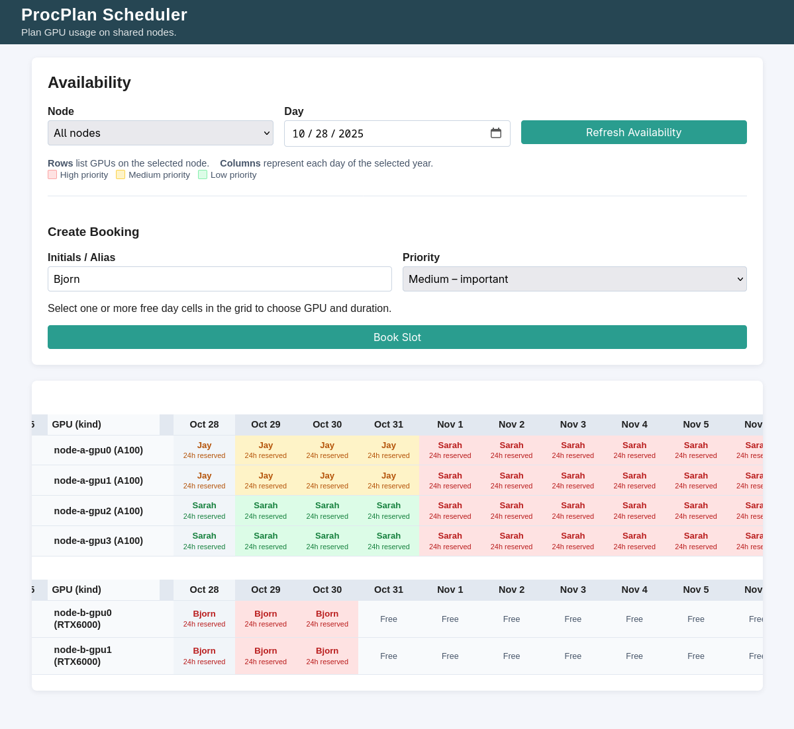

# ProcPlan – GPU Resource Planner



ProcPlan is a dependency-free GPU resource planner built entirely on the Python
standard library and SQLite. It ships with:

- **Visual daily planner** – drag across the GPU × day grid to reserve time with
  priority badges and conflict checks.
- **Command-line snapshots** – `procplan-cli` summarizes availability by GPU and day.
- **Early finish notifier** – `procplan-notify` (or a single Python import)
  releases slots the moment experiments complete.
- **Container + scripts** – run locally or via Docker/Podman with one command.

---

## Quick Start

```bash
pip install git+https://github.com/ulvgard/procplan.git
# or install from a local clone: pip install .
# Both expose procplan-cli, procplan-server, procplan-notify
python -m procplan.server \
  --config config.json \
  --database data/procplan.db \
  --host 0.0.0.0 \
  --port 8080
```

Open the web UI at `http://localhost:8080/`, select **All nodes**, and drag over
free cells to create bookings.

Prefer containers?
```bash
docker compose up --build
```
Volumes map `config.sample.json` into the container and persist state under
`./data`.

---

## CLI in 30 Seconds

```bash
procplan-cli --url http://localhost:8080 --all      # weekly view for every node
procplan-cli --url http://localhost:8080            # defaults to your host name
procplan-cli --url http://localhost:8080 --node node-a --date 2024-06-01
```

Example output:

```
Node Training Node A (node-a)
Window: 2024-06-01T00:00:00+00:00 – 2024-06-08T00:00:00+00:00
GPU              | 2024-06-01 | 2024-06-02 | 2024-06-03 | 2024-06-04 | 2024-06-05 | 2024-06-06 | 2024-06-07
------------------------------------------------------------------------------------------------------------
node-a-gpu0 (A100) | AB (High)  | -          | -          | CD (Medium)| -          | -          | -
node-a-gpu1 (A100) | -          | -          | EF (Low)   | -          | -          | -          | -
node-a-gpu2 (A100) | -          | -          | -          | -          | AB (High)  | -          | -
node-a-gpu3 (A100) | -          | -          | -          | -          | -          | -          | -
```
Columns are days, rows are GPUs, and each cell shows the booking initials with
priority.

---

## Notify and Release Early

### Python helper
```python
from procplan.notifier import signal_completion

result = signal_completion("http://scheduler.internal:8080", booking_id=42)
if not result.ok:
    print(f"Unable to notify scheduler ({result.status}): {result.message}")
```

### CLI helper
```bash
procplan-notify --url http://scheduler.internal:8080 --booking-id 42
```

---

## HTTP API Highlights

| Method | Path               | Description                                         |
|--------|--------------------|-----------------------------------------------------|
| GET    | `/api/nodes`       | List configured nodes and their GPUs.               |
| GET    | `/api/availability` | Per-hour availability (ISO 8601 timestamps).        |
| POST   | `/api/book`        | Create a booking (specify `gpu_ids` or `gpu_count`). |
| POST   | `/api/mark_done`   | Mark an active booking complete.                    |
| POST   | `/api/reload_config` | Reload node topology from disk.                    |

All timestamps are UTC and snap to whole hours.

---

## Getting Started (Deep Dive)

1. **Describe your cluster** in JSON. `config.sample.json` is a template:
   ```json
   {
     "nodes": [
       {
         "id": "node-a",
         "name": "Training Node A",
         "gpus": [
           {"id": "node-a-gpu0", "kind": "A100"},
           {"id": "node-a-gpu1", "kind": "A100"}
         ]
       }
     ]
   }
   ```

2. **Serve ProcPlan** with the command from *Quick Start* or via `docker compose`.
   The server creates the SQLite database automatically. Call `POST /api/reload_config`
   to pick up topology changes without downtime.

3. **Book GPUs** through the web UI or CLI. Bookings require initials, duration,
   and either specific GPU IDs or a count. Drag-selecting in the UI fills these
   automatically.

---

## Development Notes

- Requires **Python 3.11+** (built and tested on Python 3.13).
- Uses **only the Python standard library**; no third-party dependencies.
- SQLite operates in WAL mode for concurrency; the database file lives wherever
  you point `--database`.
- Static assets ship inside `procplan/web`; override with `--web-root` if needed.

ProcPlan v1.0.0 is ready for teams who want reliable GPU scheduling without a
stack of services. Happy planning!
